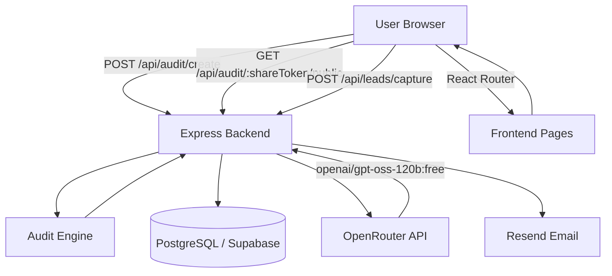

# Architecture — CredLens

## System Diagram



---

## Data Flow — How a User Input Becomes an Audit Result

```
1. User fills form on /audit/create
   → selects tools, plans, seats, use case, usage frequency

2. Frontend POSTs to /api/audit/create
   → { tools[], teamSize, useCase, needsAdminControls }

3. Express receives request
   → passes body to runAudit() — pure TypeScript function, no DB

4. runAudit() runs 5 checks per tool:
   → use case mismatch
   → admin controls upgrade
   → API to flat plan
   → plan downsize (capability-aware)
   → redundant tool detection (across all tools)
   → returns { recommendations[], redundancies[], totalMonthlySaving }

5. Backend calls OpenRouter API
   → model: openai/gpt-oss-120b:free
   → sends audit result as context
   → receives ~100 word plain-English summary

6. Backend saves to Supabase
   → audits table: tools, recommendations, savings, summary, share_token

7. Backend returns { shareToken, ...auditResult, summary }

8. Frontend redirects to /audit/:shareToken?new=true
   → results page fetches GET /api/audit/:shareToken/public
   → renders recommendations, savings, summary
   → shows lead capture form (because ?new=true)

9. User submits email
   → POST /api/leads/capture { shareToken, email, company, role }
   → leads table: audit_id, email, company, role, is_high_savings
   → Resend sends confirmation email
   → frontend cleans URL → /audit/:shareToken

10. User shares link
    → recipient opens /audit/:shareToken
    → same results page, no lead capture form
```

---

## Stack

| Layer | Technology | Why |
|---|---|---|
| Frontend | React + Vite + TypeScript | Fast dev server, strong typing |
| Styling | Tailwind CSS | Utility-first, no context switching |
| Routing | React Router v6 | Simple, declarative |
| Backend | Express + TypeScript | Lightweight, flexible |
| ORM | Prisma | Type-safe queries, easy migrations |
| Database | PostgreSQL via Supabase | Free tier, hosted, no ops overhead |
| AI Summary | OpenRouter (gpt-oss-120b) | Free tier, no API cost during build |
| Email | Resend | Simple API, generous free tier |
| Deploy | Vercel (frontend) + Render (backend) | Both free tiers, easy GitHub integration |

---

## Why Rule-Based Audit Engine

The audit math is entirely hardcoded rules — no AI involved. This was a deliberate decision. The assignment requires reasoning a finance person would agree with. LLM outputs are non-deterministic and unverifiable.Hardcoded rules are auditable, testable, and explainable line by line.

AI is used only for the summary paragraph a presentational layer that adds no business logic. If the OpenRouter API fails, the engine falls back to a templated summary and the audit still works completely.

---

## What Would Change at 10k Audits/Day

1. **Queue the AI summary** — move OpenRouter call to a background job
   (BullMQ + Redis). Return the audit immediately, stream the summary
   when ready. Currently the create endpoint blocks on the API call.

2. **Cache frequent audits** — teams with identical tool configs hit
   the same audit logic. Redis cache on the audit engine output would
   cut DB writes significantly.

3. **Rate limiting** — currently a simple in-memory rate limiter.
   At scale this needs to move to Redis so it works across multiple
   server instances.

4. **Read replicas** — the public share route is read-heavy. A
   Supabase read replica would keep the primary DB free for writes.

5. **CDN for frontend** — Vercel handles this already. No change needed.